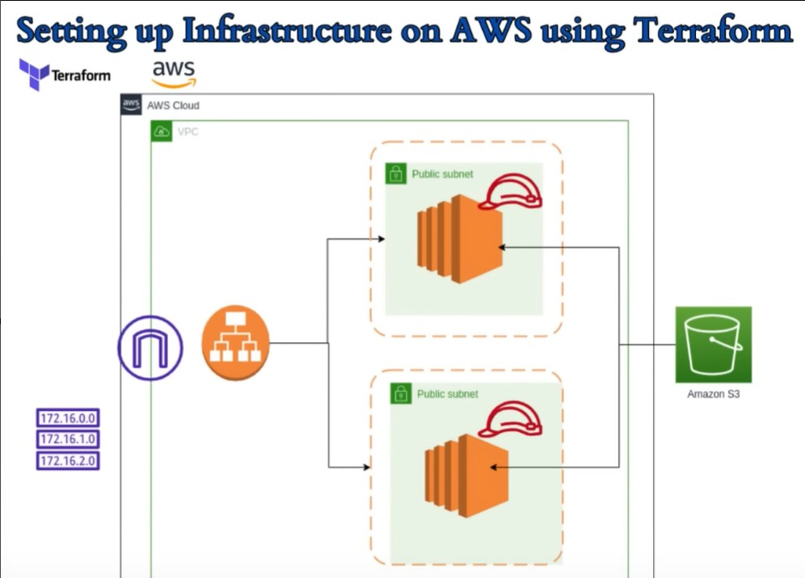

## Terraform AWS Infrastructure Provisioning using GitHub Actions (OIDC)

| Repository Name | Author    | Workflow Status                      |
| :--------       | :------- | :-------------------------------- |
| `Terraform_EC2_ALB_Project`            | `iamdevops995` |  |

## Overview
This repository demonstrates secure AWS infrastructure provisioning using Terraform and GitHub Actions with OIDC-based authentication.
No long-lived AWS credentials are stored in GitHub.

### Infrastructure: 

  

📌 Purpose

Provision AWS infrastructure using Terraform

Authenticate GitHub Actions to AWS using OIDC

Enforce safe CI/CD practices

Require manual approval before applying changes to production

🏗️ Infrastructure Provisioned

Amazon VPC

EC2 instances running Apache web server

Application Load Balancer (ALB)

Target Group and Listener

🔐 Authentication & Security

GitHub Actions authenticates to AWS using OIDC

AWS IAM role trusts GitHub’s OIDC provider

No AWS access keys are stored in secrets

Short-lived credentials via sts:AssumeRoleWithWebIdentity

🔄 CI/CD Workflow Behavior
Pull Request to main

Terraform formatting, validation, and plan are executed

Terraform plan output is posted as a PR comment

❌ No infrastructure changes are applied

Merge to main

Terraform apply is triggered

Requires manual approval using GitHub Environments

Infrastructure changes are applied only after approval

Manual Trigger

Workflow can be triggered manually

Apply step still requires approval

🛑 Manual Approval

Terraform apply is protected using a GitHub Environment

Environment name: production

Only approved reviewers can allow apply execution

This ensures production infrastructure is never changed automatically.
